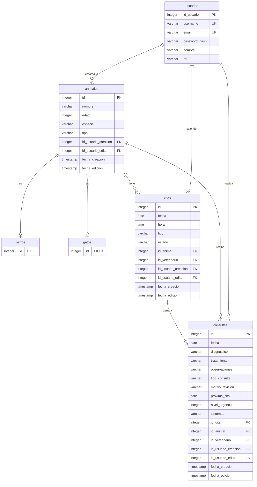

# Diagrama ER - Sistema Veterinaria

## Diagrama Entidad-Relación

## Descripción de Tablas

### usuarios
Tabla de usuarios del sistema (veterinarios, administradores, etc.)

| Campo | Tipo | Descripción |
|-------|------|-------------|
| id_usuario | INTEGER | Primary key |
| username | VARCHAR(50) | Nombre de usuario único |
| email | VARCHAR(100) | Correo electrónico único |
| password_hash | VARCHAR(255) | Hash de la contraseña |
| nombre | VARCHAR(100) | Nombre completo |
| rol | VARCHAR(20) | Rol del usuario (veterinario, admin, etc.) |

### animales
Tabla base para herencia de tabla (joined table inheritance)

| Campo | Tipo | Descripción |
|-------|------|-------------|
| id | INTEGER | Primary key |
| nombre | VARCHAR(100) | Nombre del animal |
| edad | INTEGER | Edad en años |
| especie | VARCHAR(50) | Especie del animal |
| tipo | VARCHAR(20) | Discriminador polimórfico |
| id_usuario_creacion | INTEGER | FK a usuarios |
| id_usuario_edita | INTEGER | FK a usuarios |
| fecha_creacion | TIMESTAMP | Fecha de creación |
| fecha_edicion | TIMESTAMP | Fecha de última edición |

### perros
Tabla específica para perros (hereda de animales)

| Campo | Tipo | Descripción |
|-------|------|-------------|
| id | INTEGER | PK y FK a animales.id |

### gatos
Tabla específica para gatos (hereda de animales)

| Campo | Tipo | Descripción |
|-------|------|-------------|
| id | INTEGER | PK y FK a animales.id |

### citas
Tabla de citas médicas agendadas

| Campo | Tipo | Descripción |
|-------|------|-------------|
| id | INTEGER | Primary key |
| fecha | DATE | Fecha de la cita |
| hora | TIME | Hora de la cita |
| tipo | VARCHAR(20) | Tipo (revision, urgencias) |
| estado | VARCHAR(20) | Estado (pendiente, confirmada, cancelada) |
| id_animal | INTEGER | FK a animales |
| id_veterinario | INTEGER | FK a usuarios |
| id_usuario_creacion | INTEGER | FK a usuarios |
| id_usuario_edita | INTEGER | FK a usuarios |
| fecha_creacion | TIMESTAMP | Fecha de creación |
| fecha_edicion | TIMESTAMP | Fecha de última edición |

### consultas
Tabla de consultas médicas realizadas

| Campo | Tipo | Descripción |
|-------|------|-------------|
| id | INTEGER | Primary key |
| fecha | DATE | Fecha de la consulta |
| diagnostico | VARCHAR(500) | Diagnóstico realizado |
| tratamiento | VARCHAR(500) | Tratamiento prescrito |
| observaciones | VARCHAR(500) | Observaciones adicionales |
| tipo_consulta | VARCHAR(20) | Discriminador (revision, urgencia) |
| motivo_revision | VARCHAR(200) | Motivo (solo revision) |
| proxima_cita | DATE | Próxima cita (solo revision) |
| nivel_urgencia | INTEGER | Nivel 1-5 (solo urgencia) |
| sintomas | VARCHAR(500) | Síntomas (solo urgencia) |
| id_cita | INTEGER | FK a citas |
| id_animal | INTEGER | FK a animales |
| id_veterinario | INTEGER | FK a usuarios |
| id_usuario_creacion | INTEGER | FK a usuarios |
| id_usuario_edita | INTEGER | FK a usuarios |
| fecha_creacion | TIMESTAMP | Fecha de creación |
| fecha_edicion | TIMESTAMP | Fecha de última edición |

## Relaciones

1. **usuarios → animales**: Un usuario crea/edita múltiples animales (auditoría)
2. **usuarios → citas**: Un veterinario atiende múltiples citas
3. **usuarios → consultas**: Un veterinario realiza múltiples consultas
4. **animales → citas**: Un animal tiene múltiples citas
5. **animales → consultas**: Un animal recibe múltiples consultas
6. **animales → perros**: Herencia de tabla (un animal puede ser un perro)
7. **animales → gatos**: Herencia de tabla (un animal puede ser un gato)
8. **citas → consultas**: Una cita genera una consulta
